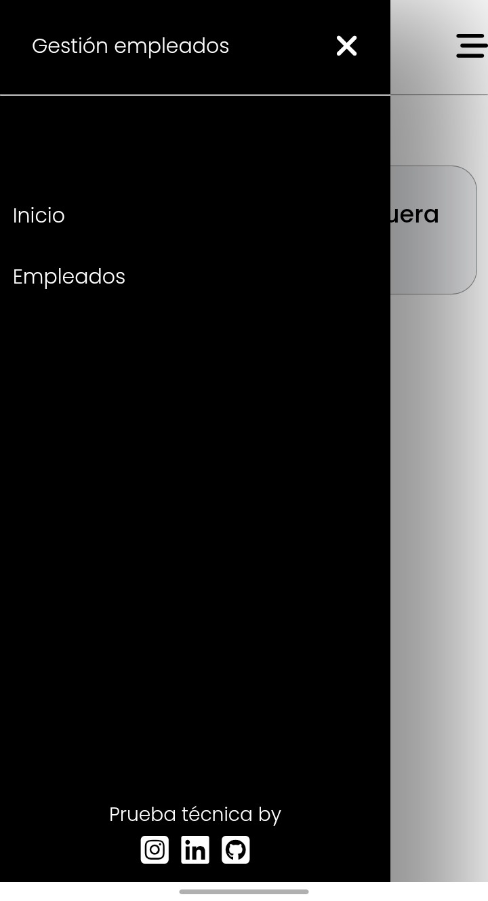
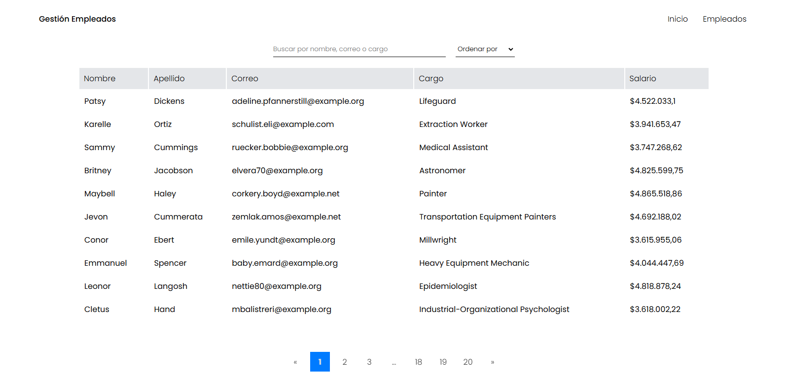

# 📌 Aplicación de Gestión de Empleados

## 📋 Descripción
Esta aplicación permite gestionar empleados, visualizar su información y aplicar filtros de búsqueda y paginación. Utiliza **React** en el frontend y consume datos desde una API.

## 🚀 Tecnologías Utilizadas
- **React** (Vite)
- **React Router** para la navegación
- **React Paginate** para la paginación

## 🎯 Funcionalidades
✅ Listado de empleados con paginación 📄
✅ Búsqueda por nombre, correo o cargo 🔍
✅ Filtros de ordenamiento por nombre o salario 📊
✅ Navegación a detalle de empleados 🔗
✅ Interfaz responsiva

## ⚙️ Instalación y Ejecución
1️⃣ Clonar el repositorio:
```bash
git clone https://github.com/YonierGM/Prueba-tecnica-frontend-developer-React.git
cd tu-repo
```
2️⃣ Instalar dependencias:
```bash
npm install  # o yarn install
```
3️⃣ Ejecutar la aplicación:
```bash
npm run dev  # o yarn dev
```

## 🖼️ Vista Previa

### 📌 Menu mobile


### 📌 Listado desktop


### 📌 Listado mobile


### 📌 Detalle empleado


### 📌 Asistencia empleado


### 📌 Home

